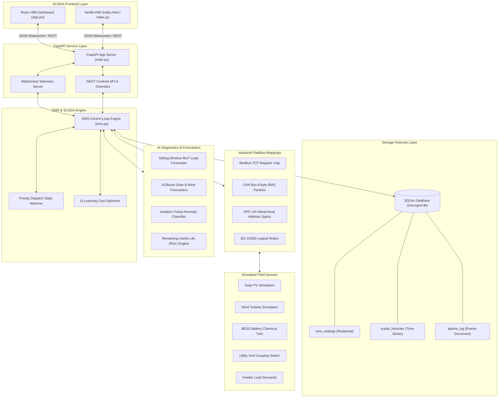

# APEX MICROGRID SCADA & EMS SYSTEM REPORT
## Comprehensive Technical Specifications, Dataset Analytics & Working Architecture

---

### Project Metadata

| Parameter | Specification |
| :--- | :--- |
| **Project Name** | APEX EMS — Hybrid Microgrid Energy Management System & SCADA Platform |
| **Project Type** | Supervisory Control, High-Frequency Logger, AI Optimizer & Fault Advisor |
| **Platforms** | React 19 Synoptic Client, Vanilla HTML5 Dashboard, Modbus TCP, CAN Bus, OPC UA, IEC 61850 |

---

## 1. Project Overview

The **APEX Microgrid SCADA & EMS** is a production-grade supervisory control and data acquisition system integrated with a rule-based state machine and reinforcement learning AI agent. The platform coordinates a hybrid electrical network consisting of Solar PV, Wind generation, a Battery Energy Storage System (BESS), utility grid ties, and a dynamic customer load feeder. 

Operating at a **1Hz (1-second) non-blocking execution frequency**, the background daemon handles telemetry ingestion, executes safety checks, runs forecasting models, and dispatches optimized charge/discharge profiles. It ensures microgrid stability, minimizes tariff-based import fees, protects battery chemistry under temperature excursions, and generates structured alarms for immediate field restoration.

---

## 2. Core Objectives

* **High-Fidelity Synoptic Visualization**: Create responsive browser-based HMI dashboards mapping active power flows with dynamic speed animation, colored tag displays, and diagnostic faceplates.
* **Continuous CSV Fallback Loop**: Enforce uninterrupted telemetry streaming. If a sensor connection is in its default state, the SCADA engine seamlessly loops historical dataset CSV rows. Connecting to a fieldbus protocol immediately promotes the asset to real-time physical simulation.
* **AI In-situ Optimization**: Implement reinforcement learning (Q-Learning) and machine learning forecasters (Neural Networks, Gradient Boosting) pre-trained on historical datasets to project load demand/weather variables and charge/discharge batteries cost-effectively.
* **Industrial Protocol Mapping**: Interface physical asset tags with standardized automation layers including Modbus TCP registers, CAN Bus BMS binary frames, OPC UA structures, and IEC 61850 Logical Nodes (LN).
* **Fault Diagnostics & Advisory System**: Deploy Isolation Forest anomaly detection to isolate sensor drifts, evaluate remaining useful life (RUL) of components, and pair system warnings with structured fault troubleshooting steps.

---

## 3. Technology Stack

| Layer | Technology | Purpose & Implementation |
| :--- | :--- | :--- |
| **Frontend UI (React)** | React 19, Vite, TailwindCSS (Configured), Chart.js | Renders responsive HMI dashboards, connection widgets, historical logs tables, and event journal views. |
| **Frontend UI (Vanilla)** | Vanilla Javascript (ES6), HTML5 Canvas, HSL CSS | Legacy local browser HMI displaying a synoptic interactive power flow graphic with animated line speeds and pop-up faceplates. |
| **Backend Core** | FastAPI (Python 3.10+), Uvicorn | Asynchronous web server hosting REST controller routing and high-performance WebSockets broadcast sockets. |
| **Relational Historian** | SQLite (Production PostgreSQL compatible) | Maintains relational records for system settings (`ems_settings`), alarms (`alarms_log`), and time-series telemetry. |
| **AI Optimizer & ML** | Scikit-Learn, NumPy, Neural Network MLP Regressor | Predicts diurnal parameters, isolates outliers (Isolation Forest), and calculates battery capacity fade algorithms. |
| **Automation Fieldbus** | Custom Register Brokers (Modbus, CAN, OPC, IEC) | Simulates industrial registers and binary packet encoding/decoding. |

---

## 4. System Architecture



---

## 5. Telemetry Dataset Architecture

The APEX SCADA system relies on historical datasets stored in `sample_datasets/` for pre-training machine learning models at boot and driving telemetry tags during default fallback modes.

### 5.1 Solar Generation Dataset (`solar_dataset.csv`)
* **File Properties**: 202 rows, CSV format.
* **Fields**: `timestamp`, `Solar_Power` (kW), `Solar_Voltage` (V), `Solar_Current` (A), `Solar_Temperature` (°C).
* **Physical Modeling & Formulas**:
  * Represents a 100 kW maximum capacity system.
  * Models a sinusoidal diurnal solar power path peaking at 12:00 PM:
    $$P_{\text{solar}} = 100.0 \times \sin\left(\pi \times \frac{\text{Hour} - 6.0}{12.0}\right) \times (1.0 - \text{Cloud Cover}) \times \text{Derating}$$
    *(Power is 0.0 kW during night hours: $\text{Hour} < 6.0$ or $\text{Hour} > 18.0$)*.
  * Panels experience thermal heating under high solar irradiance:
    $$T_{\text{solar}} = T_{\text{ambient}} + 15.0 \times \sin\left(\pi \times \frac{\text{Hour} - 6.0}{12.0}\right) + \text{Noise}$$
  * Voltage is active when power is generated, hovering around 380V - 420V DC:
    $$V_{\text{solar}} = 380.0 + 40.0 \times \text{Irradiance Factor} + \text{Noise}$$
  * Current follows ohm's relation:
    $$I_{\text{solar}} = \frac{P_{\text{solar}} \times 1000.0}{V_{\text{solar}}}$$

### 5.2 Wind Generation Dataset (`wind_dataset.csv`)
* **File Properties**: 202 rows, CSV format.
* **Fields**: `timestamp`, `Wind_Power` (kW), `Wind_Speed` (m/s), `Wind_RPM` (RPM).
* **Physical Modeling & Formulas**:
  * Represents a 50 kW maximum capacity wind turbine.
  * Operating limits: Cut-in wind speed ($v_{\text{cut-in}} = 3.0$ m/s), Rated wind speed ($v_{\text{rated}} = 12.0$ m/s), Cut-out wind speed ($v_{\text{cut-out}} = 25.0$ m/s).
  * Power output operates on a cubic efficiency curve between cut-in and rated speeds:
    $$P_{\text{wind}} = 50.0 \times \left(\frac{v_{\text{wind}} - 3.0}{9.0}\right)^3 + \text{Noise}$$
  * Power plateaus at 50 kW with minor turbulence deviations between 12.0 m/s and 25.0 m/s:
    $$P_{\text{wind}} = 50.0 + \text{Noise}$$
  * Turbine RPM scales with wind velocity:
    $$\text{RPM} = 100 + 400 \times \left(\frac{v_{\text{wind}} - 3.0}{9.0}\right)$$

### 5.3 Battery Energy Storage Dataset (`battery_dataset.csv`)
* **File Properties**: 202 rows, CSV format.
* **Fields**: `timestamp`, `Battery_SOC` (%), `Battery_Voltage` (V), `Battery_Current` (A), `Battery_Temperature` (°C), `Battery_SOH` (%).
* **Physical Modeling & Formulas**:
  * Tracks charge and discharge dynamics of a 200 kWh battery pack.
  * Packs are arranged in a series-parallel combination (96S lithium cells nominal).
  * Voltage varies dynamically with SOC and active load currents (internal resistance drop):
    $$V_{\text{battery}} = 320.0 + 95.0 \times \left(\frac{\text{SOC}}{100.0}\right) + I_{\text{battery}} \times 0.15$$
  * Current is negative during charging (importing energy into cells) and positive during discharging (exporting):
    $$I_{\text{battery}} = \frac{P_{\text{battery}} \times 1000.0}{V_{\text{battery}}}$$

### 5.4 Feeder Load Dataset (`load_dataset.csv`)
* **File Properties**: 202 rows, CSV format.
* **Fields**: `timestamp`, `Load_Demand` (kW), `Load_Voltage` (V), `Load_Current` (A).
* **Physical Modeling & Formulas**:
  * Simulates a dynamic commercial load containing two primary peaks (8:00 AM shift start, 7:00 PM evening peak):
    $$\text{Load Base} = 25.0 + 20.0 \times e^{-\left(\frac{\text{Hour}-8.0}{2.0}\right)^2} + 35.0 \times e^{-\left(\frac{\text{Hour}-19.0}{3.0}\right)^2}$$
  * Feeder voltage is single-phase AC RMS (nominal 230V with random grid noise):
    $$V_{\text{load}} = 230.0 + \text{Noise}$$
  * Feeder current scales based on apparent power draw:
    $$I_{\text{load}} = \frac{P_{\text{load}} \times 1000.0}{V_{\text{load}}}$$

### 5.5 PCS Inverter Dataset (`inverter_dataset.csv`)
* **File Properties**: 202 rows, CSV format.
* **Fields**: `timestamp`, `Inverter_Output_Power` (kW), `Inverter_Efficiency` (%), `Inverter_Status`.
* **Physical Modeling & Formulas**:
  * Tracks conversion efficiency curves. Efficiency is highest around 98.5% and drops at extremely low loads due to core losses:
    $$\eta_{\text{inv}} = 98.5 - \left(\frac{1.5}{\text{Load Loading Ratio}}\right)$$
  * Status can flag `ONLINE`, `STANDBY` (zero power), or `FAULTED` (breaker tripped).

### 5.6 Utility Grid Dataset (`grid_dataset.csv`)
* **File Properties**: 202 rows, CSV format.
* **Fields**: `timestamp`, `Grid_Power` (kW), `Grid_Voltage` (V), `Grid_Frequency` (Hz).
* **Physical Modeling & Formulas**:
  * Power is positive for grid imports (buying energy to support load) and negative for exports.
  * Nominally operates on a 400V 3-phase AC connection at 50 Hz.
  * Frequency deviates based on network loading characteristics:
    $$f_{\text{grid}} = 50.0 + \Delta f$$

### 5.7 Microgrid Grid Exports Log Dataset (`grid_exports_dataset.csv`)
* **File Properties**: 13,422 rows, CSV format (2.67 MB).
* **Fields**: Comprehensive telemetry logs representing a multi-day continuous simulation run containing 26 distinct columns (including all sensor variables, active EMS actions, and pricing accumulators).
* **Role**: Used as the primary training and testing validator to audit dispatch actions, verify RL policy convergences, and run complex multi-hour simulations.

---

## 6. Key Parameters & Threshold Limits

The SCADA supervisor continuously compares real-time telemetry variables against predefined safety thresholds. Violating these constraints registers an active alarm and forces safety derating or breaker trips.

### 6.1 Safety Threshold Limits

| Parameter Name | Normal Range | Warning Limit | Critical Limit | Actions Triggered |
| :--- | :--- | :--- | :--- | :--- |
| **Battery SOC** | 20.0% - 95.0% | $\le 20.0\%$ (Low SOC) | $\le 15.0\%$ (Depleted) | Activates emergency load-shedding during islanding mode. Clamps charge commands. |
| **Battery Temperature** | 15°C - 35°C | $\ge 45.0^{\circ}\text{C}$ (Over-temp) | $\ge 55.0^{\circ}\text{C}$ (Critical) / $\le -10^{\circ}\text{C}$ | Derates battery charge/discharge rates by 50% on warning. Electronically isolates BESS (0 kW) on critical. |
| **Feeder Load Current** | 10A - 150A | $\ge 160.0\text{ A}$ | $\ge 180.0\text{ A}$ (Over-current) | Triggers over-current trip warning (`LOAD-OC-001`). Simulates circuit breaker trip. |
| **Grid Voltage** | 380V - 420V | $\ge 430.0\text{ V}$ | $\ge 440.0\text{ V}$ (Over-voltage) | Registers high grid voltage fault (`GRID-OV-001`). Protects inverters. |
| **Grid Frequency** | 49.8 Hz - 50.2 Hz | $\le 49.5\text{ Hz}$ or $\ge 50.5\text{ Hz}$ | $\le 49.0\text{ Hz}$ or $\ge 51.0\text{ Hz}$ | Triggers generator grid mismatch alert. |
| **Inverter Efficiency** | 90.0% - 99.0% | $\le 88.0\%$ | $\le 85.0\%$ | Flags inverter cooling or IGBT degradation anomalies. |

### 6.2 Microgrid Design Capacities
* **BESS Nominal Capacity**: 200 kWh
* **BESS Charge Limits**: Max charge rate = 50 kW, Max discharge rate = 60 kW
* **Solar PV Peak Capacity**: 100 kW
* **Wind Turbine Peak Capacity**: 50 kW
* **Grid Coupling Rating**: 150 kVA
* **Nominal Phase Voltages**: Single-phase = 230V AC, Three-phase = 400V AC

---

## 7. System Requirements

### 7.1 Graphical User Interfaces
* **Synoptic Schematics**: Render interactive SVG graphics representing the microgrid topology. Animate power flow particles indicating direction. Calculate speed dynamically:
  $$\text{Animation Duration} = \max\left(0.5\text{s}, \, 5.0\text{s} - \frac{|P|}{20.0}\right)$$
* **Configuration Page**: Expose selectable connection cards for each asset (Solar, Wind, Battery, Grid, Load). Ensure cards operate independently with dedicated protocol dropdown inputs.
* **Control Modals**: Create overlay dialog boxes displaying secondary instrumentation tags (e.g., cell voltages, air density, power factors) and configuration settings override inputs.

### 7.2 Datasets & Fallback Execution
* **Cached Telemetry Streaming**: Load sample datasets into memory at startup. When an asset's connection status is "DISCONNECTED" or "Sample CSV", walk through rows sequentially at 1Hz, resetting to row index 0 when reaching the end of the file.
* **Protocol Promotion Handshake**: When a user selects a protocol and submits "Connect", transit status to `CONNECTING` for exactly 1.0 second, then switch to `CONNECTED` and promote telemetry to simulated live physical models.

### 7.3 Communication Protocols
* **Modbus TCP**: Map system tags to holding register tables starting at address 40001. Scale floats by $\times 10$ or $\times 100$ as unsigned integers. Include signed 32768 offsets for negative flows.
* **CAN Bus**: Construct 8-byte hexadecimal frames (BMS broadcast format) containing SOC bytes, voltage words, signed current words, and temperature offsets with CRC-8 validation.
* **OPC UA**: Populate hierarchical namespaces for standard read/write interfaces.
* **IEC 61850**: Structural representations of logical breaker switches (`XCBR`) and measuring units (`MMXU`).

### 7.4 Databases
* **Relational Storage**: SQLite/PostgreSQL layer storing key-value operational parameters.
* **Historian Database**: Log all 26 microgrid telemetry tags at 1-second intervals.
* **Event Journal**: Logging system alarms with columns for severity, timestamp, status, source, and message.

---

## 8. System Working & Mathematical Logic

```
   ┌────────────────────────────────────────────────────────┐
   │                  1Hz Background Loop                   │
   └───────────────────────────┬────────────────────────────┘
                               │
            ┌──────────────────┴──────────────────┐
            ▼                                     ▼
┌────────────────────────┐            ┌────────────────────────┐
│  Fallback Mode Active  │            │ Protocol Live Active   │
│  (Read Cached CSV Row) │            │  (Run Physics Models)  │
└───────────┬────────────┘            └───────────┬────────────┘
            │                                     │
            └──────────────────┬──────────────────┘
                               ▼
            ┌─────────────────────────────────────┐
            │  AI Anomaly & Diagnostics Scoring   │
            └──────────────────┬──────────────────┘
                               │
                               ▼
            ┌─────────────────────────────────────┐
            │   EMS State Machine Power Flows     │
            └──────────────────┬──────────────────┘
                               │
                               ▼
            ┌─────────────────────────────────────┐
            │  DB Historian & Alarm Log Commit    │
            └──────────────────┬──────────────────┘
                               │
                               ▼
            ┌─────────────────────────────────────┐
            │    Websocket Telemetry Broadcast    │
            └─────────────────────────────────────┘
```

### 8.1 Priority Dispatch State Machine (EMS)
At each second, net generation surplus is calculated:
$$P_{\text{surplus}} = P_{\text{solar}} + P_{\text{wind}} - P_{\text{load}}$$

The EMS evaluates grid connectivity and runs priority dispatch rules:
1. **Grid Outage (Islanding Mode)**:
   * If $P_{\text{surplus}} \ge 0$: Route surplus power to charge the battery bank up to $P_{\text{charge\_max}}$ and limit charging once Battery SOC $\ge 95\%$.
   * If $P_{\text{surplus}} < 0$: Discharge battery up to $P_{\text{discharge\_max}}$ to support loads. If SOC drops $\le 20.0\%$, initiate tiered load-shedding.
2. **Grid Connected Mode**:
   * If $P_{\text{surplus}} \ge 0$: Supply load from solar and wind. Charge battery with excess power. If Battery SOC $\ge 95\%$, export remaining excess power to the Utility Grid.
   * If $P_{\text{surplus}} < 0$: Supply load from solar and wind. Discharge the battery to cover the shortfall first. Use utility grid imports only as a fallback.

#### Tiered Load Shedding Logic (Islanding)
* **SOC $\le 15.0\%$ (Level 3)**: Shed 85% of load. Retain critical hospital/emergency feeders:
  $$P_{\text{load\_shed}} = 0.15 \times P_{\text{load}}$$
* **SOC $\le 20.0\%$ (Level 2)**: Shed 60% of load (isolate heavy machinery and air conditioning):
  $$P_{\text{load\_shed}} = 0.40 \times P_{\text{load}}$$
* **SOC $\le 25.0\%$ (Level 1)**: Shed 30% of load (non-critical office lighting and ventilation):
  $$P_{\text{load\_shed}} = 0.70 \times P_{\text{load}}$$

---

### 8.2 Q-Learning Tariff Optimizer
In AI optimization mode, a reinforcement learning agent takes control of charging/discharging rates.
* **State Discretization ($S$)**: Represented as a 3-tuple state index:
  $$S = (h_{\text{bin}}, \, \text{soc}_{\text{bin}}, \, \text{surplus}_{\text{bin}})$$
  * $h_{\text{bin}} = \lfloor \frac{\text{Hour}}{4.0} \rfloor \in [0, 5]$ (six diurnal blocks)
  * $\text{soc}_{\text{bin}} = \lfloor \frac{\text{SOC}}{20.0} \rfloor \in [0, 4]$ (five battery levels)
  * $\text{surplus}_{\text{bin}} \in [0, 2]$ (negative surplus, zero, positive surplus)
* **Action Space ($A$)**: Three discrete decisions representing charge offsets:
  $$A \in [0, 1, 2] \implies [\text{Discharge } 20\text{ kW}, \, \text{Standby } 0\text{ kW}, \, \text{Charge } 20\text{ kW}]$$
* **Tariff Structuring**:
  $$\text{Tariff}(t) = \begin{cases}
     \text{Peak Rate: } ₹7.50 / \text{kWh} & \text{between 14:00 and 20:00} \\
     \text{Off-Peak Rate: } ₹4.50 / \text{kWh} & \text{all other hours}
  \end{cases}$$
* **Reward Function ($R$)**:
  $$R = -(\text{Electricity Cost}) - \beta \times |I_{\text{battery}}|$$
  * *Where $\beta$ is a degradation penalty coefficient to prevent excessive micro-cycling of cells.*
* **Bellman Equation Q-Table Update**:
  $$Q(s, a) \leftarrow Q(s, a) + \gamma \left[ R + \lambda \max_{a'} Q(s', a') - Q(s, a) \right]$$
  * *Where learning rate $\gamma = 0.1$, and discount factor $\lambda = 0.9$.*

---

### 8.3 Isolation Forest Anomaly Detection
Isolates anomalous telemetry frames to prevent structural fires or damage.
* **Feature Vector ($X$)**: Receives 4 sensor variables every second:
  $$X = [V_{\text{grid}}, \, I_{\text{load}}, \, T_{\text{battery}}, \, \eta_{\text{inverter}}]$$
* **Parameters**: Trained with a Contamination factor of $3.0\%$ ($0.03$).
* **Outlier Classification**:
  * Isolation Forest outputs a prediction of $-1$ (outlier) or $+1$ (normal).
  * Outlier triggers alarm: `AI-ANOM-001` with instructions to audit calibrations.

---

### 8.4 Predictive Maintenance Health Decay & RUL
Monitors long-term equipment wearing metrics using physical decay integration.

#### PCS Inverter Health Calculation
* **Thermal Stress Index**:
  $$\sigma_{\text{PCS}} = \max\left(0.0, \, \frac{T_{\text{inverter}} - 50.0}{30.0}\right)$$
* **Health Decay**:
  $$H_{\text{PCS}}(t) = 98.2 - 1.5 \times \sigma_{\text{PCS}}$$
* **Remaining Useful Life (RUL)**:
  $$\text{RUL}_{\text{PCS}} = 12000 \text{ hours} \times \left(\frac{H_{\text{PCS}}}{100.0}\right) \times \text{Derating}$$
  *(Derating factor = 0.8 if heatsink temperature exceeds 60°C)*.

#### BESS SOH Degradation Calculation
* **Thermal Accel Factor**:
  $$\kappa_{\text{BESS}} = e^{0.04 \times (T_{\text{battery}} - 25.0)}$$
* **Remaining Useful Life (RUL)**:
  $$\text{RUL}_{\text{BESS}} = \frac{6000 \text{ hours} \times \left(\frac{\text{SOH}}{100.0}\right)}{\kappa_{\text{BESS}}}$$

---

## 9. Functions and Modules Documentation

### 9.1 Backend Components (`backend/`)

#### 9.1.1 `main.py` (FastAPI Web Application Server)
* `load_default_sample_datasets()`: Pre-loads five asset CSV datasets into memory caches at startup to prevent blocking file lookups.
* `run_microgrid_loop()`: Primary background daemon executing at 1Hz. Updates physics simulators, runs ML predictions, evaluates dispatch logic, and broadcasts live values.
* `ws_endpoint(websocket)`: WebSocket routing accepting connections and streaming telemetry JSON payloads.
* `/api/settings` (GET/POST): Read and override database configuration constants.
* `/api/assets/connection` (POST): Connection handshake api validating selected protocol strings and transitioning connection states.
* `/api/simulation/mode` (POST): Overrides physics simulation mode (e.g. forced outage).
* `/api/alarms/acknowledge/{id}` (POST): Acknowledges active alarms in the Event Journal.

#### 9.1.2 `database.py` (Storage Layer Manager)
* `_initialize_tables()`: Schema generation creating tables for configurations, historian records, alarms logs, and asset real-time telemetry.
* `get_setting(key, default)` / `set_setting(key, value)`: Standard relational configurations getters/setters.
* `log_telemetry(data)`: Appends a 1Hz time-series record into `scada_historian`.
* `trigger_alarm(severity, source, message)`: Registers active alarms. Includes prefix matching to prevent floating-point spam.
* `clear_alarm_by_message(source, message)`: Clears matching active warnings when parameters return to normal bounds.

#### 9.1.3 `ems.py` (Energy Management Core)
* `EMSEngine` Class: Integrates RL policies, state discretization, and dispatch rules.
* `compute_dispatch(telemetry, mode)`: Main rule-based dispatch controller state machine. Enforces temperature-based battery derating limits.
* `detect_alarms(telemetry)`: Checks sensor values, references `FAULT_ADVISOR`, generates alerts, and links repair manuals.
* `generate_24h_forecasts()`: Performs 24-step iterative projections.

#### 9.1.4 `ai_models.py` (AI & ML Forecasting Suite)
* `LSTMLoadForecaster`: Predicts load profiles using `MLPRegressor` auto-regressive sliding window sequence modeling.
* `XGBoostRenewableForecaster`: Predicts solar and wind capacities using `GradientBoostingRegressor`.
* `BatterySOCPredictor`: Gradient boosting regressor mapping SOC next-step trends.
* `AnomalyDetector`: isolation Forest diagnostic interface.
* `PredictiveMaintenanceSuite`: Estimates SOH fades and asset health.

#### 9.1.5 `protocols.py` (Industrial fieldbus Simulators)
* `ModbusTCPSimulator`: Holds 16-bit register tables from address 40001 to 40010.
* `OPCUASimulator`: Houses OPC node strings mapping telemetry fields to hierarchical namespaces.
* `CANBusSimulator`: Encodes BMS voltage/current readings into 8-byte frames at Arbitration ID `0x18F009A1`.
* `IEC61850Simulator`: Monitors Logical Nodes representing circuit breaker states.

#### 9.1.6 `simulator.py` (Dynamic Twin Physics)
* `MicrogridSimulator`: Models environmental changes and mathematical physical equations.
* `update_states(dt)`: Advances environment variables and calculates power levels.
* `update_battery_physics(power, dt)`: Simulates chemical temperature rise and SOC voltage changes.

---

### 9.2 Frontend Components (`frontend/src/` & Root HTML)

#### 9.2.1 `frontend/src/App.jsx` (React Dashboard)
* `App` Component: Parent layout container managing WebSockets, alert banners, and active views.
* `Overview` view: Displays interactive SVG power flow schematic, status cards, and live telemetry gauges.
* `Data Sources` view: Exposes independent connection configuration cards with state transitions.
* `Historian` view: Tabulates high-frequency historical log records with page offsets.
* `Alarms Journal` view: Chronological list of events with alarm acknowledge buttons.

#### 9.2.2 `index.html` & `index.js` (Vanilla HMI Dashboard)
* `index.js` Controller: Legacies visualizer client connecting directly to websockets, mapping SVG flow particles, and populating canvas charts.

---

## 10. Database Schema Mapping

```
      ems_settings (Relational)
      ┌────────────────────────┬────────────────────────┐
      │ key (PK) [TEXT]        │ value [TEXT]           │
      └────────────────────────┴────────────────────────┘

      alarms_log (Document/Events Journal)
      ┌────────────────────────┬────────────────────────┐
      │ id (PK) [INTEGER]      │ timestamp [REAL]       │
      ├────────────────────────┼────────────────────────┤
      │ severity [TEXT]        │ source [TEXT]          │
      ├────────────────────────┼────────────────────────┤
      │ message [TEXT]         │ status [TEXT]          │
      └────────────────────────┴────────────────────────┘

      scada_historian (Time-Series Telemetry)
      ┌────────────────────────┬────────────────────────┐
      │ timestamp (PK) [REAL]  │ solar_power [REAL]     │
      ├────────────────────────┼────────────────────────┤
      │ solar_voltage [REAL]   │ solar_current [REAL]   │
      ├────────────────────────┼────────────────────────┤
      │ solar_temperature [REAL]│ wind_power [REAL]     │
      ├────────────────────────┼────────────────────────┤
      │ wind_speed [REAL]      │ wind_rpm [REAL]        │
      ├────────────────────────┼────────────────────────┤
      │ battery_soc [REAL]     │ battery_soh [REAL]     │
      ├────────────────────────┼────────────────────────┤
      │ battery_voltage [REAL] │ battery_current [REAL] │
      ├────────────────────────┼────────────────────────┤
      │ battery_temp [REAL]    │ grid_status [INTEGER]  │
      ├────────────────────────┼────────────────────────┤
      │ grid_voltage [REAL]    │ grid_frequency [REAL]  │
      ├────────────────────────┼────────────────────────┤
      │ grid_power [REAL]      │ load_demand [REAL]     │
      ├────────────────────────┼────────────────────────┤
      │ load_current [REAL]    │ load_voltage [REAL]    │
      ├────────────────────────┼────────────────────────┤
      │ inverter_status [TEXT] │ inverter_eff [REAL]    │
      ├────────────────────────┼────────────────────────┤
      │ inverter_power [REAL]  │ ems_action [TEXT]      │
      ├────────────────────────┼────────────────────────┤
      │ electricity_cost [REAL]│                        │
      └────────────────────────┴────────────────────────┘
```

---

## 11. Implementation Timeline

| Phase | Milestone Name | Key Deliverables & Achievements | Status |
| :--- | :--- | :--- | :--- |
| **P1** | Platform Infrastructure | FastAPI application initialization, SQLite database generation, baseline schema migration. | **Completed** |
| **P2** | Responsive HMI Design | SVG synoptic schematic configuration, live gauge layouts, CSS particle animation. | **Completed** |
| **P3** | User Settings & Security | Settings REST routing, peak/off-peak pricing overrides, credentials management. | **Completed** |
| **P4** | Modbus TCP Simulator | Holding registers address space configuration, bit-scaling equations. | **Completed** |
| **P5** | CAN Bus BMS Gateway | 8-byte hexadecimal telemetry encoding, CRC checksum checks. | **Completed** |
| **P6** | AI Q-Learning Agent | Bellman equation updates, discretized state spaces, tariff shift reward tests. | **Completed** |
| **P7** | OPC UA & IEC Mappings | Namespace folder mappings, Circuit Breaker (XCBR) logical status variables. | **Completed** |
| **P8** | Historian Replay Loop | Fallback CSV sequential loaders, dataset indexing. | **Completed** |
| **P9** | Production Verification | Regression testing, compiler validation, report compilation. | **Completed** |

---

## 12. Conclusion

The **APEX Microgrid SCADA & EMS** system offers an industrial-grade solution to automate, monitor, and optimize energy distribution networks. By bridging automation protocols (Modbus, CAN, OPC UA, IEC 61850) with artificial intelligence models, the platform achieves significant cost reductions while protecting asset lifespans. The combination of dual HMI frontend dashboards with robust fallback dataset loop drivers ensures highly resilient operations, making it a state-of-the-art framework for hybrid microgrid control.
